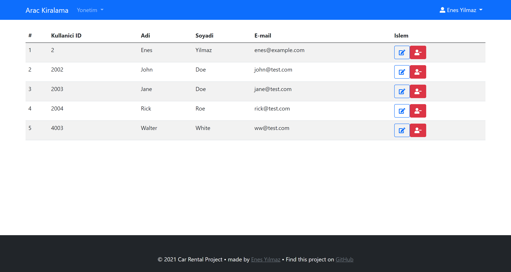

# ReCapProjectFrontend

Bu proje <a href="https://github.com/Metheal/ReCapProject">ReCapProject</a> isimli projenin Front-end kismidir.  
`Angular CLI version 11.2.3.` ile yazilmistir.  
Calistirmak icin cmd ya da terminal uzerinde `ng serve -o` yazin. Tarayici uzerinde `http://localhost:4200/` adresinde gelistirme sunucusunda acilacaktir.  

## Ozellikler:

### Kullanici icin:

- Kayit olma
- Kullanici ve Musteri kimligini guncelleme
- Arac kiralama
- Sonraki kiralamalar icin kredi kartini kaydetme
- Kiralamalarini listeleme

### Yonetici icin:

- Arac ekleme - duzenleme - silme
- Arac resimleri ekleme - silme
- Renk ekleme - duzenleme - silme
- Marka ekleme - duzenleme - silme
- Tum kullanicilari ve musterileri listeleme - duzenleme - silme
- Tum kiralamalari listeleme

## Ekran Goruntuleri:

### Kullanici bakis acisiyla: 

### Yonetici bakis acisiyla: 

